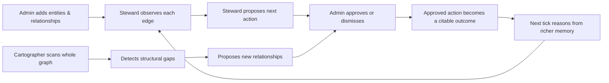
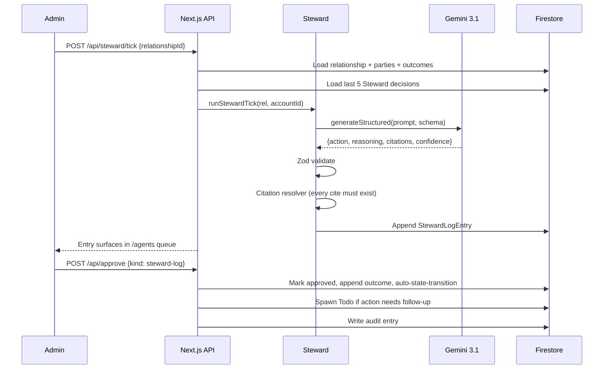
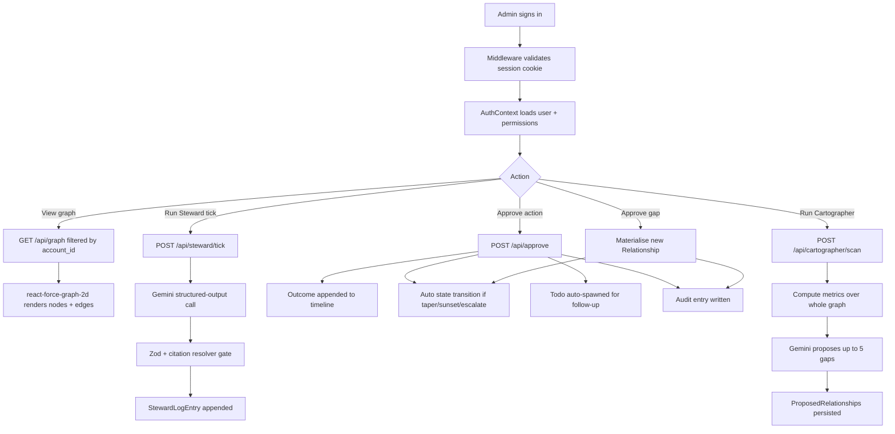
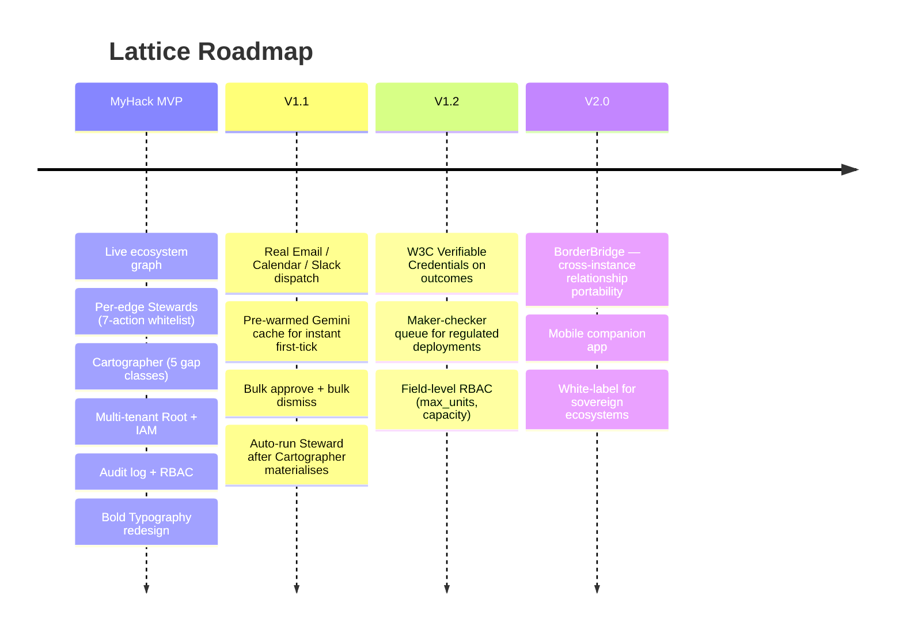

<div align="center">

# 🔗 Lattice
### *Relationships that run themselves. An ecosystem that completes itself.*

<p align="center">
  
  
  
  
  
</p>

<p align="center">
  
  
  
  
  
</p>

---

### Stop coordinating. Start governing.

Innovation ecosystems still depend on manual coordination to verify participants, match mentors, assign companies to programmes, and manage partner linkages. **Lattice turns every one of those linkages into a first-class AI agent** — a Steward that proposes its own next action, grounded in past outcomes and gated by structured citations. A second meta-agent — **Cartographer** — scans the whole graph for structural gaps and proposes new relationships to fill them.

</div>

---

## ✨ Overview

**Lattice** is built for **programme owners and ecosystem administrators** at accelerators, corporate venture arms, university spinout offices, and government agencies like Cradle. We turn manual coordination into governed automation by closing the feedback loop between *what happened* and *what should happen next*:

- **Model** → every linkage is a typed `Relationship` with state, policy, and a memory of past outcomes
- **Observe** → outcomes are appended to the timeline; embeddings retrieve the most relevant prior ones
- **Reason** → per-edge Steward picks one action from a 7-action whitelist, cites every claim
- **Detect** → graph-wide Cartographer surfaces structural gaps the human eye misses
- **Govern** → root-and-IAM RBAC, audit log of every admin action, no AI execution without human approval

> If your accelerator burns operations time tracking mentor-founder pairings in spreadsheets, Lattice replaces the spreadsheet with a **graph of self-running agents** under your governance.

---

## 📊 The Lattice numbers

<div align="center">

|   |  |
|---|---|
| **4** | Relationship types — `mentorship` · `company_in_programme` · `partner_in_initiative` · `service_engagement` |
| **7** | Steward actions — `propose-session` · `draft-checkin` · `propose-intro` · `escalate` · `taper` · `sunset` · `hold` |
| **5** | Cartographer gap classes — `over_allocation` · `under_utilization` · `missing_expertise` · `dormant_partner` · `programme_bottleneck` |
| **0** | Manual coordination needed once a relationship is wired |

</div>

The schema is closed: judges and admins know exactly what the AI can propose. There is no open-ended "Steward decides anything" surface — every action is one of the seven, and every gap is one of the five.

---

## 🧩 Product Components

### 1) 🛰 Steward — per-relationship AI
`lib/agents/steward.ts` · invoked by `POST /api/steward/tick`

Each row in `relationships/` carries its own Steward. On every tick the agent:

| Step | What happens |
|------|-------------|
| **Load** | Pull the relationship doc, both parties, all outcomes |
| **Retrieve** | Top-5 recent outcomes by timestamp; if >5 exist, top-3 by embedding similarity to focus + memory |
| **Recall** | Last 5 of the agent's own decisions and how the admin reacted (approved / dismissed / pending) |
| **Propose** | Gemini 3.1 returns one of 7 actions + reasoning + citations + confidence |
| **Validate** | Zod schema → citation resolver (every claim must cite a real Firestore doc) → confidence floor |
| **Log** | Append a `StewardLogEntry`; admin sees it in the Agents queue |

Steward **proposes**. Nothing executes without an admin approval.

---

### 2) 🗺 Cartographer — graph-wide meta-agent
`lib/agents/cartographer.ts` · invoked by `POST /api/cartographer/scan`

Cartographer reads the entire account: every entity, every relationship, every outcome, every prior proposal. Then it:

1. Computes pure metrics (capacity utilization, dormancy days, unmet expertise demand, programme bottleneck counts)
2. Feeds the metric summary + proposal history to Gemini
3. Surfaces up to 5 structural gaps as `ProposedRelationship` docs
4. Pre-commits a `proposed_focus` + `proposed_cadence` for each, so approval is a single click

Approval **auto-materialises** a new `Relationship` with focus and cadence pre-set. The graph updates immediately.

---

### 3) 🔒 Identity & RBAC — AWS-shaped
`lib/auth/permissions.ts`

| Role | Permissions |
|---|---|
| **Root** | All 11 permissions including `iam.manage` and `seed.run` |
| **Admin** | All except IAM management |
| **Approver** | `steward.run`, `cartographer.run`, `approve.write` — no policy or actor mutation |
| **Viewer** | Read-only |

Server-side enforcement on every mutating route via `requireUser([perms])`. Multi-tenant — one Firebase project can host any number of root accounts; `account_id` is on every query.

---

### 4) 🌐 Force-directed Graph
`app/graph/GraphClient.tsx`

Two-axis edge encoding so each state reads instantly:

| State | Colour | Pattern | Particles |
|---|---|---|---|
| `active` | Type colour | Solid | 2 (flowing) |
| `proposed` | Vermillion override | Long dash | 1 (slow) |
| `escalated` | Red override (unmissable) | Solid thick | 3 (fast) |
| `tapered` | Type colour @ 30% | Dotted | 0 |
| `closed` | Grey ghost | Solid faint | 0 |

Click any node to inspect or edit. Click any edge to open its full Steward log, policy editor, and outcome timeline.

---

## 🚀 Core Value Loop



---

## 🧠 Agent Workflow



---

## 🏗 System Architecture

```mermaid
flowchart TB
    subgraph FE[Frontend Next.js App Router]
        L[Landing /]
        DASH[Dashboard]
        GFX[Force Graph]
        AG[Agents queue]
        TD[Todos]
        AUD[Audit log]
        IAM[IAM mgmt]
    end

    subgraph MW[Middleware]
        COOKIE[Session cookie gate]
    end

    subgraph API[API Routes Node runtime]
        AUTH[Auth: signup/session/me/account]
        ACTORS[/api/actors]
        RELS[/api/relationships]
        TICK[/api/steward/tick]
        SCAN[/api/cartographer/scan]
        APR[/api/approve]
        STATS[/api/stats]
        ADMIN[/api/admin/backfill]
    end

    subgraph AGENTS[Agents]
        ST[Steward]
        CR[Cartographer]
        CIT[Citation resolver]
    end

    subgraph EXT[External]
        FB[Firebase Auth]
        FS[Firestore]
        GM[Gemini 3.1 chat]
        EM[Gemini embedding-001]
    end

    FE --> MW --> API
    API --> FB
    API --> FS
    TICK --> ST --> GM
    SCAN --> CR --> GM
    ST & CR --> CIT --> FS
    APR --> FS
    AGENTS --> EM
```

---

## 🌱 Why This Matters

### The Cradle Problem (from the MyHack 2026 brief)

> Innovation ecosystem platforms still depend on manual coordination to verify participants, match mentors, assign companies to programmes, and manage partner linkages. As ecosystems scale, these relationships remain ad hoc and difficult to reuse, making operations heavy, inconsistent, and hard to extend across geographies and initiatives.

Four pain points the brief identifies:

| Pain | Lattice answer |
|---|---|
| **Complex Actor Networks** | Live force-directed graph; every linkage clickable to its full memory |
| **Everything Is Manual Today** | Per-edge Stewards propose the next action automatically |
| **Growth Amplifies the Pain** | Cartographer detects structural gaps before humans notice |
| **Lost Intelligence** | Every approved outcome is a citable record; next tick retrieves it via embeddings |

### The Solution

Lattice doesn't replace the admin. It compresses their decision surface from *"what should happen across 200 relationships?"* to *"yes / no on a queue of 5 proposed actions."* The AI does the watching. The human keeps governance.

---

## 🌍 SDG Alignment

| Goal | How Lattice contributes |
|---|---|
| **SDG 9 — Industry, Innovation and Infrastructure** | Connective infrastructure for innovation ecosystems that compounds across programmes instead of restarting per cohort |
| **SDG 17 — Partnerships for the Goals** | Relationship-as-entity is multi-stakeholder partnership made programmable, governable, and portable |
| **SDG 8 — Decent Work and Economic Growth** | Better-coordinated ecosystems mean more successful entrepreneurship outcomes per unit of mentor/admin time |

---

## 🧰 Tech Stack

### AI & ML
- **Google Gemini 3.1** — structured-output JSON for both Steward and Cartographer
- **Gemini `embedding-001`** — outcome retrieval, cosine similarity
- **Zod** — runtime schema validation as a second-line defence against shape drift
- **Citation resolver** — every claim must cite a real Firestore doc or a known metric

### Application
- **Next.js 14 App Router** + TypeScript strict
- **Tailwind v3** with custom Bold Typography design system (Inter Tight + Playfair Display + JetBrains Mono)
- **`react-force-graph-2d`** — canvas-based graph with custom node + edge rendering

### Auth & data
- **Firebase Auth** — HTTP-only session cookies, Admin SDK server-side
- **Firestore** — Admin SDK on the server, account-scoped queries (`.where('account_id', '==', accountId)`)
- **Multi-tenant** — one Firebase project can hold many root accounts side by side

### Infrastructure
- **Next.js `output: 'standalone'`** for Docker
- **Google Cloud Run** — single `gcloud run deploy` from this repo
- **`@view-transition`** for smooth route fades; `prefers-reduced-motion` respected per WCAG 2.3.3

---

## ⚙️ Prerequisites

- **Node.js 18+**
- **A Google Cloud project** with Firestore (Native mode) and Firebase Auth enabled
- **Firebase Admin SDK service-account JSON** (one-line, single-quoted in `.env.local`)
- **Gemini API key** (from Google AI Studio)

---

## 🚀 Setup Guide

### 1) Clone + install

```bash
git clone https://github.com/Infinite-Unknown/lattice.git
cd lattice
npm install
```

### 2) Configure environment

Create `.env.local`:

```env
# Gemini
GEMINI_API_KEY=your-google-ai-studio-key
GEMINI_MODEL=gemini-3.1-flash-lite
GEMINI_EMBED_MODEL=gemini-embedding-001

# Firebase web (from Firebase Console → Project Settings)
NEXT_PUBLIC_FIREBASE_API_KEY=AIzaSy...           # exactly 39 chars
NEXT_PUBLIC_FIREBASE_AUTH_DOMAIN=...firebaseapp.com
NEXT_PUBLIC_FIREBASE_PROJECT_ID=your-project-id
NEXT_PUBLIC_FIREBASE_STORAGE_BUCKET=...appspot.com
NEXT_PUBLIC_FIREBASE_MESSAGING_SENDER_ID=...
NEXT_PUBLIC_FIREBASE_APP_ID=1:...:web:...

# Firebase Admin (single-quoted, one-line JSON)
FIREBASE_ADMIN_CREDENTIALS='{"type":"service_account","project_id":"...","private_key":"...","client_email":"..."}'
```

### 3) Enable Firebase services

- Authentication → Sign-in method → **Email/Password = enabled**
- Firestore Database → Create database (Native mode, test mode for dev)

### 4) Run

```bash
npm run dev
```

Open http://localhost:3000.

### 5) Seed (optional)

`npm run seed` populates an existing account with a small ecosystem fixture. For the prepared 4-tenant demo state with IAM users and the showcase Malaysia ecosystem, see [`DEMO.md`](DEMO.md).

---

## 📦 Repository Structure

```
lattice/
├── app/                                      # Next.js App Router
│   ├── page.tsx, LandingClient.tsx           # Public landing
│   ├── sign-in/, sign-up/                    # Auth pages
│   ├── dashboard/, DashboardClient.tsx       # Stat strip + recent activity
│   ├── graph/                                # Force-directed graph + add/edit entity modals
│   ├── agents/                               # Steward + Cartographer queue
│   ├── todos/                                # Action queue with dispatch placeholders
│   ├── audit/                                # Governance log
│   ├── iam/                                  # IAM user management (root only)
│   ├── relationships/[id]/                   # Per-relationship detail
│   ├── api/                                  # All server routes
│   │   ├── auth/                             # signup, session, me, account, accounts/lookup
│   │   ├── actors/, relationships/           # CRUD + cascade delete
│   │   ├── steward/tick, cartographer/scan   # Agent invocations
│   │   ├── approve, inbox, stats, todos      # Decision queue + read APIs
│   │   ├── iam/users                         # IAM management
│   │   └── admin/backfill                    # One-shot tenant claim for pre-migration data
│   └── components/                           # Modal, Button, Input, LatticeLoader, Skeleton
│
├── lib/
│   ├── agents/                               # Steward, Cartographer, citation resolver, prompts
│   ├── auth/                                 # Permissions, identity, current-user
│   ├── data/                                 # Account-scoped Firestore access (one file per collection)
│   ├── seed/                                 # seed.ts + reset.ts (4-tenant fixture)
│   ├── format.ts                             # humaniseLabel, resolveCitation, rewriteReasoning
│   ├── gemini.ts                             # generateStructured wrapper
│   ├── embeddings.ts                         # embed + cosine
│   ├── schemas.ts                            # Zod schemas for Steward + Cartographer outputs
│   └── types.ts                              # Actor, Relationship, Outcome, ProposedRelationship, Todo
│
├── middleware.ts                             # Session-cookie gate
├── tailwind.config.ts                        # Bold Typography design system
├── tests/                                    # Vitest — schemas, citation-resolver, graph-metrics (19 tests)
└── docs/                                     # Specs + plans + architecture deep-dives
```

---

## 🔄 End-to-End Data Flow



---

## 🧭 Roadmap



---

## 🏆 What Makes Lattice Different

This is not a CRM with a workflow tab.

| Layer | What we built |
|---|---|
| **Schema** | Relationships are typed first-class entities with their own AI, memory, and policy — not rows in a "matches" table |
| **AI** | Two-tier agent system. Per-edge Stewards reason locally. A graph-wide Cartographer reasons structurally. Both gated by Zod + citation resolution |
| **Anti-hallucination** | Structural, not aspirational — every claim must cite a real Firestore doc; whitelist of 7 actions, 5 gap classes; confidence floor surfaces low-conf calls visibly |
| **Multi-tenant** | One Firebase project hosts many root accounts; every query filtered by `account_id`; backfill endpoint included for pre-migration data |
| **Governance** | Root + IAM with 4 roles and 11 permissions; every admin action recorded in a 14-action audit catalog |
| **UX** | Bold Typography design system, force-directed graph with two-axis edge encoding, mobile hamburger drawer, reduce-motion safe |
| **Deployment** | Single `gcloud run deploy` from this repo. Free-tier-capable at small scale; unit economics in the deck |

---

## 🤝 Team

Built for **Build with AI 2026 KL · MyHack** at Sunway University, May 16–17 2026.

Problem statement: *Automating Ecosystem Linkages Instead of Manual Coordination* — Cradle Fund Sdn Bhd.

Contact for the brief: `faiz.hassan@cradle.com.my`

---

<div align="center">

## 🔗 Stop coordinating. Start governing.
## 🤖 Let the Stewards run the relationships.
## 🗺 Let the Cartographer find the gaps.

**Lattice — Autonomous Ecosystem Operations.**

</div>
